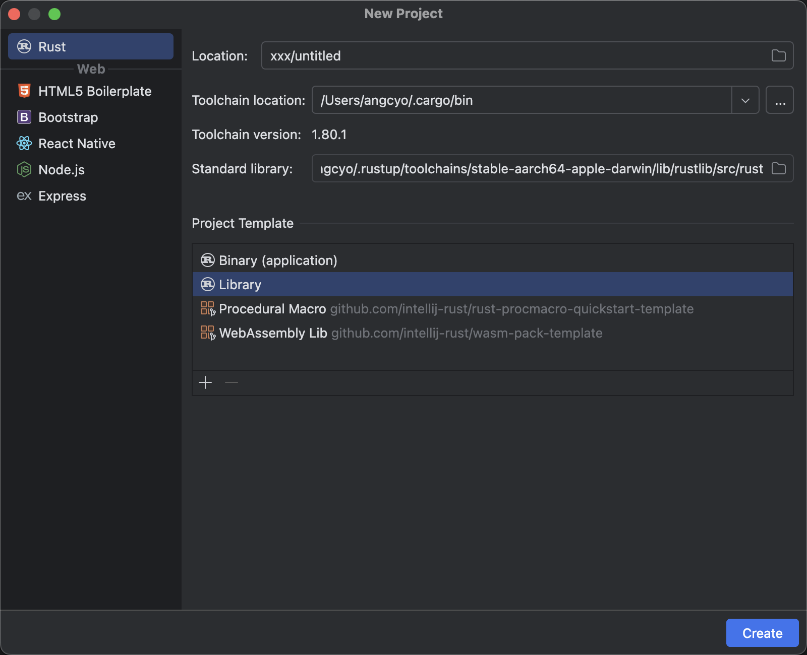
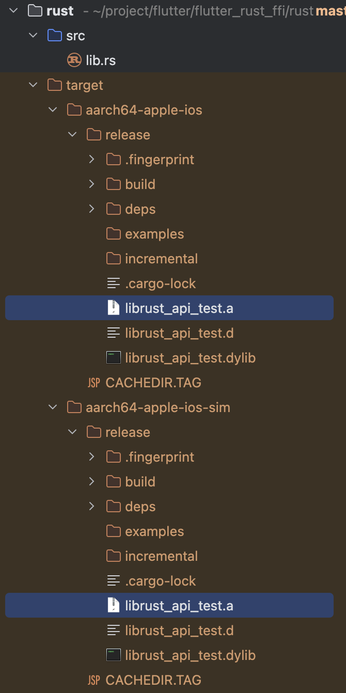
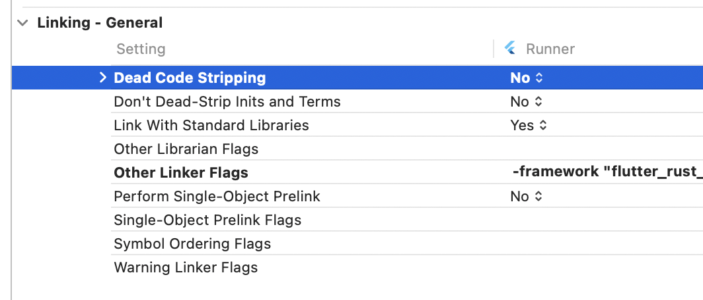
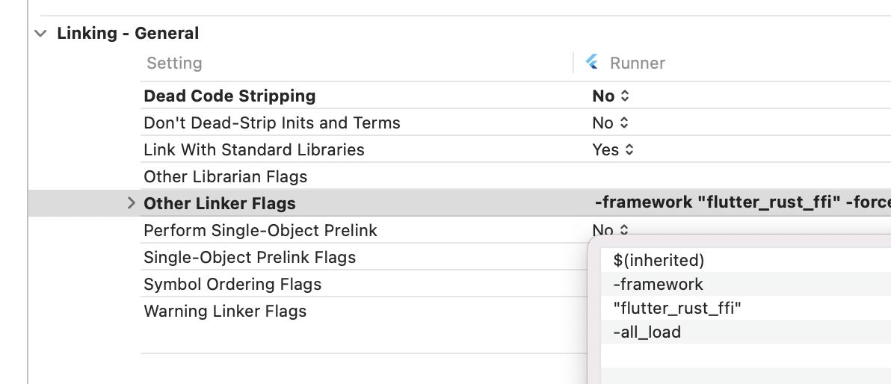

# flutter_rust_ffi

`Flutter` 通过`ffi`调用`Rust`编译生成的产物.so文件(Android)和.a文件(iOS)接口方法;

拾用本文您将获取以下技能:

- `Rust`编译.so文件的能力;
- `Rust`编译.a文件的能力;
- `Flutter`调用.so文件的能力;
- `Flutter`调用.a文件的能力;

附加`Buff`:

- `Flutter`环境安装指南;
- `Rust`环境安装指南;
- `Android`不同架构(v7a/v8a)的.so文件加载方式;
- `iOS`不同设备(真机/模拟器)的.a文件加载方式;

## 本文环境

- 开发电脑: `Apple M3 Max`
- Flutter IDE: `Android Studio Koala | 2024.1.1 Patch 2`
- iOS IDE: `Xcode Version 15.4`
- Rust IDE: `RustRover 2024.1.7`
- Flutter: `Flutter 3.24.0 / Dart 3.5.0`
- Rust: `rustc 1.80.1 / rustup 1.27.1`

# 环境准备

- 开发电脑: 自行解决
- Flutter IDE: https://developer.android.com/studio
- iOS IDE: https://developer.apple.com/cn/xcode
- Rust IDE: https://www.jetbrains.com/zh-cn/rust/
- Flutter: https://docs.flutter.dev/get-started/install
- Rust: https://www.rust-lang.org/learn/get-started

# 使用`Rust`编译`.so`

## 工程准备

使用`Rust IDE`创建一个`Library`的工程.



在`Cargo.toml`文件中配置库的类型.

`[lib]`的描述说明可以参考: https://doc.rust-lang.org/cargo/reference/cargo-targets.html#library


- `cdylib`用于输出`.so`
- `staticlib`用于输出`.a`

如果您还想了解更多类型可以参考: https://doc.rust-lang.org/reference/linkage.html

之后在`src/lib.rs`文件里面写上非常牛逼自信的高级算法.


工程准备就绪之后, 就可以着手编译了.

## 安装编译链

`rustup target add aarch64-linux-android armv7-linux-androideabi`

- `aarch64-linux-android` 用于输出`arm64-v8a`的.so文件
- `armv7-linux-androideabi` 用于输出`armeabi-v7a`的.so文件

您可以通过`rustup target list`查看所有支持的工具链.

## 安装编译工具

`cargo install cargo-ndk`

- `cargo-ndk` 用来编译so文件

## 编译

`cargo ndk -t armeabi-v7a -t arm64-v8a build --release`

关于`cargo ndk`更多用法可以参考: https://github.com/bbqsrc/cargo-ndk

- `arm64-v8a`平台的so文件输出在`target/aarch64-linux-android/release/xxx.so`
- `armeabi-v7a`平台的so文件输出在`target/armv7-linux-androideabi/release/xxx.so`


之后将产物分别复制到`Flutter`工程中的`android/src/main/jniLibs/arm64-v8a`和`android/src/main/jniLibs/armeabi-v7a`这样在`Android`平台上,就会根据`CPU`的架构自动加载对应的so文件, 这一点在`iOS`平台上需要手动处理, 在介绍`iOS`时, 会提及.

到这为止, `Android`平台的产物`so文件`就已经输出了. 接下来编译`iOS`.

# 使用`Rust`编译`.a`

## 工程准备

与上述一致.

## 安装编译链

`rustup target add aarch64-apple-ios aarch64-apple-ios-sim`

- `aaarch64-apple-ios` 用于输出`iPhone真机`的.a文件
- `aarch64-apple-ios-sim` 用于输出`iPhone模拟器`的.a文件

您可以通过`rustup target list`查看所有支持的工具链.

## 安装编译工具

`cargo install cargo-lipo`

- `cargo-lipo` 用来编译.a文件

## 编译

`cargo lipo --targets aarch64-apple-ios --release`
`cargo lipo --targets aarch64-apple-ios-sim --release`

这里要分开2个命令编译不同的文件.

关于`cargo lipo`更多用法可以参考: https://github.com/TimNN/cargo-lipo

- `iPhone真机`的a文件输出在`target/aarch64-apple-ios/release/xxx.a`
- `iPhone模拟器`的a文件输出在`target/aarch64-apple-ios-sim/release/xxx.a`



之后将产物分别复制到`Flutter`工程中的`ios/iphoneos`(iPhone真机)和`ios/iphonesimulator`(iPhone模拟器).

之后在iOS工程中的`xxx.podspec`文件中加入:

```
...
s.user_target_xcconfig = {
'OTHER_LDFLAGS' => '-force_load ${PODS_ROOT}/../.symlinks/plugins/flutter_rust_ffi/ios/${PLATFORM_NAME}/librust_api_test.a'
}
...
```

- `${PLATFORM_NAME}`是用来自动加载`iPhone真机`或`iPhone模拟器`的关键.

如果要区分`i386`或`arm64`架构, 可以使用`${ARCHS_STANDARD_INCLUDING_64_BIT}`环境变量.

之后在`Flutter`工程中的`example/ios`文件夹中使用`pod install`命令.

到这为止, `iOS`平台的产物`a文件`就已经输出了.

# `Rust`导出`ffi`

上述生成的产物还不支持`ffi`调用, 所以这里阐述一下.

传统的导出`ffi`的方式`extern fn`比较繁琐, 并且不易于生成`.h`头文件.

参考: https://doc.rust-lang.org/nomicon/ffi.html

这里使用`safer_ffi`库(https://getditto.github.io/safer_ffi/)导出`ffi`

首先在`Cargo.toml`文件中加入`safer-ffi`依赖:

```toml
[dependencies]
safer-ffi = "0.1.12"
```

并且指定特性:

```toml
[features]
headers = ["safer-ffi/headers"]
```

其次在需要导出的方法中使用`#[ffi_export]`宏:

```rust
#[ffi_export]
pub fn test_bool(value: bool) -> bool {
    !value
}
```

最后配置一下生成头文件名的方法`generate_headers`:

```rust
#[test]
#[cfg(feature = "headers")]
fn generate_headers() -> std::io::Result<()> {
    safer_ffi::headers::builder()
        .to_file("rust_api_test.h")?
        .generate()
}
```

之后就可以使用命令运行这个方法`generate_headers`生成对应的头文件了:

`cargo test --lib generate_headers --features headers`

# `Flutter`导入`ffi`

> 使用`Flutter`创建一个`FFI Plugin`工程, 既可以获得相应的模板代码.

有了`.h`头文件, `Flutter`就可以借助`ffigen`工具创建对应的`dart`绑定类

`dart run ffigen --config ffigen.yaml`

`ffigen.yaml`配置文件内容, 请参考: https://pub.dev/packages/ffigen 文档. 很简单, 只需要指定对应的`.h`文件位置即可.

这里需要注意的是, `Flutter`在加载`.so`文件或`.a`文件时, 有所差异.

- 加载`.so`文件直接使用默认的`DynamicLibrary.open('lib$_libName.so');`方法即可.
- 但是加载`.a`文件则需要使用`DynamicLibrary.executable();`方法.

```dart
final DynamicLibrary _dylib = () {
  if (Platform.isMacOS || Platform.isIOS) {
    //return DynamicLibrary.open('$_libName.framework/$_libName');
    return DynamicLibrary.executable();
  }
  if (Platform.isAndroid || Platform.isLinux) {
    return DynamicLibrary.open('lib$_libName.so');
  }
  if (Platform.isWindows) {
    return DynamicLibrary.open('$_libName.dll');
  }
  throw UnsupportedError('Unknown platform: ${Platform.operatingSystem}');
}();
```

到这里为止, `Flutter`就已经可以在`Android`平台上愉快的调用`ffi`了, 而不需要额外的配置.

但是, 在`iOS`平台上, 会有问题, 如下:

- `IOS Failed to lookup symbol (dlsym(RTLD_DEFAULT, test_func): symbol not found)`

为了解决这个问题, 您需要在`Xcode`中进行如下配置:

- 导航到`TARGETS->Runner->Build Settings->Linking - General`将`Dead Code Stripping`配置改成`No`(这是iOS移除未使用的代码用的)



- 在同级的`Ohter Linker Flags`中加入`-all_load`(这是加载所有符号表用的)



> 这里说明一点: `-all_load`和上文中的`-force_load xxx.a`作用是一致的,自行取其一配置即可.

配置完成之后, `rebuild`Flutter在`iOS`平台上也可以愉快的调用`ffi`了.

文中源码有所省略, 文末有开源代码仓库地址, 欢迎食用.

至此文章就结束了!

---

**群内有`各(pian)种(ni)各(jin)样(qun)`的大佬,等你来撩.**

# 联系作者

[点此QQ对话](http://wpa.qq.com/msgrd?v=3&uin=664738095&site=qq&menu=yes)  `该死的空格`    [点此快速加群](https://shang.qq.com/wpa/qunwpa?idkey=cbcf9a42faf2fe730b51004d33ac70863617e6999fce7daf43231f3cf2997460)


[开源地址](https://github.com/angcyo/flutter_rust_ffi)

